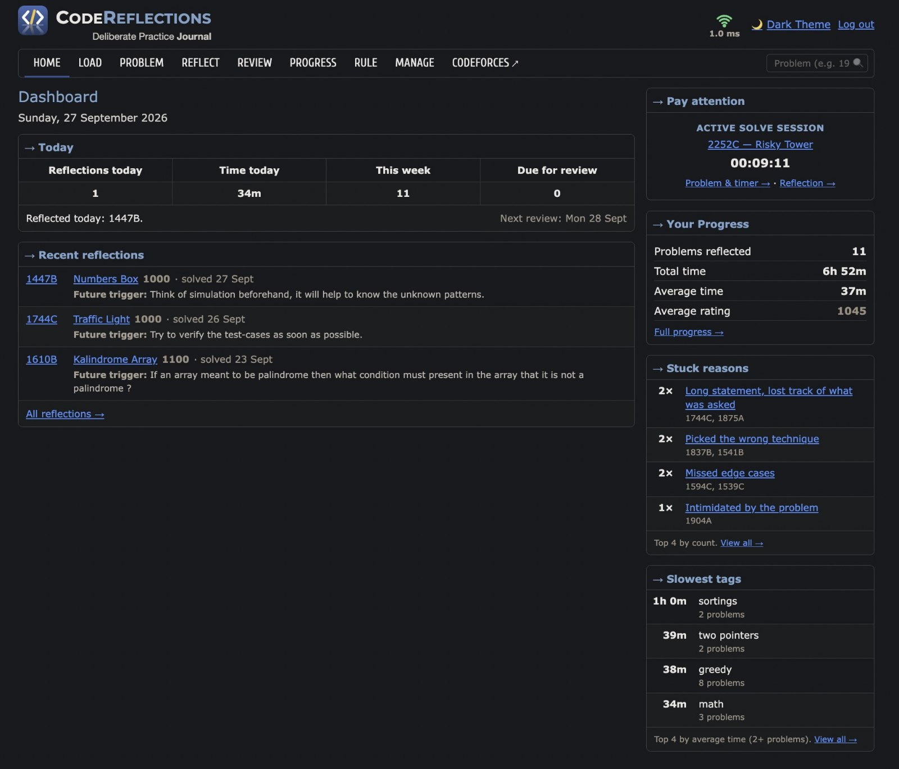
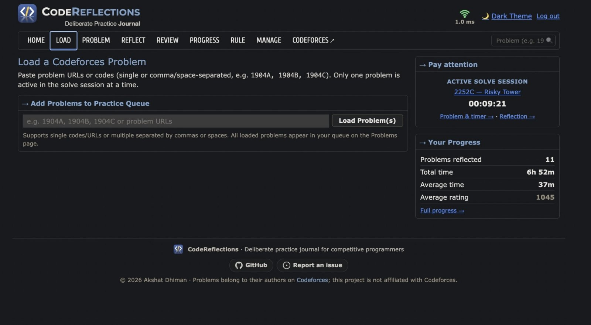
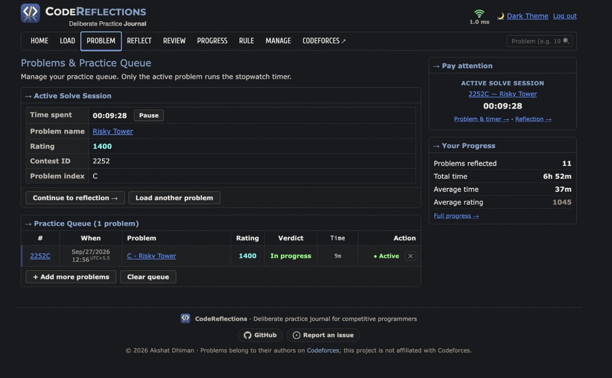
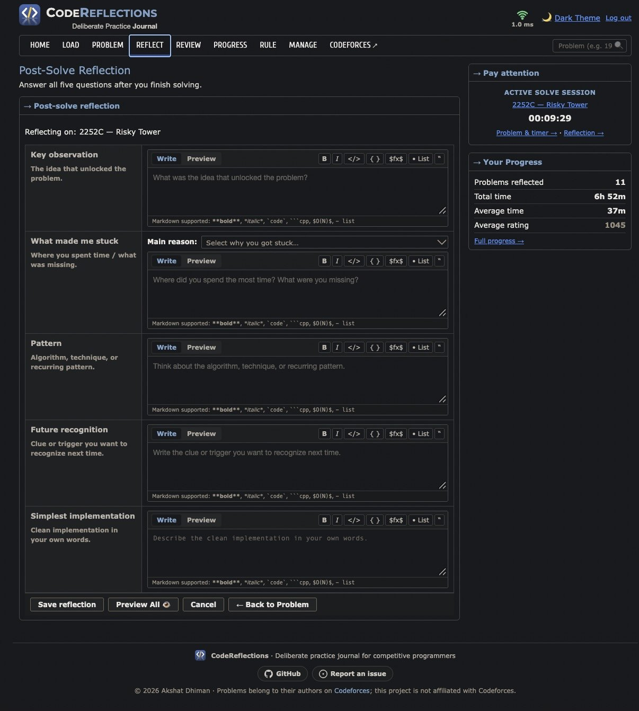
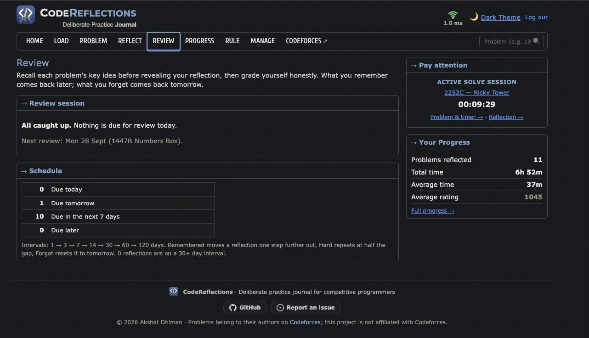
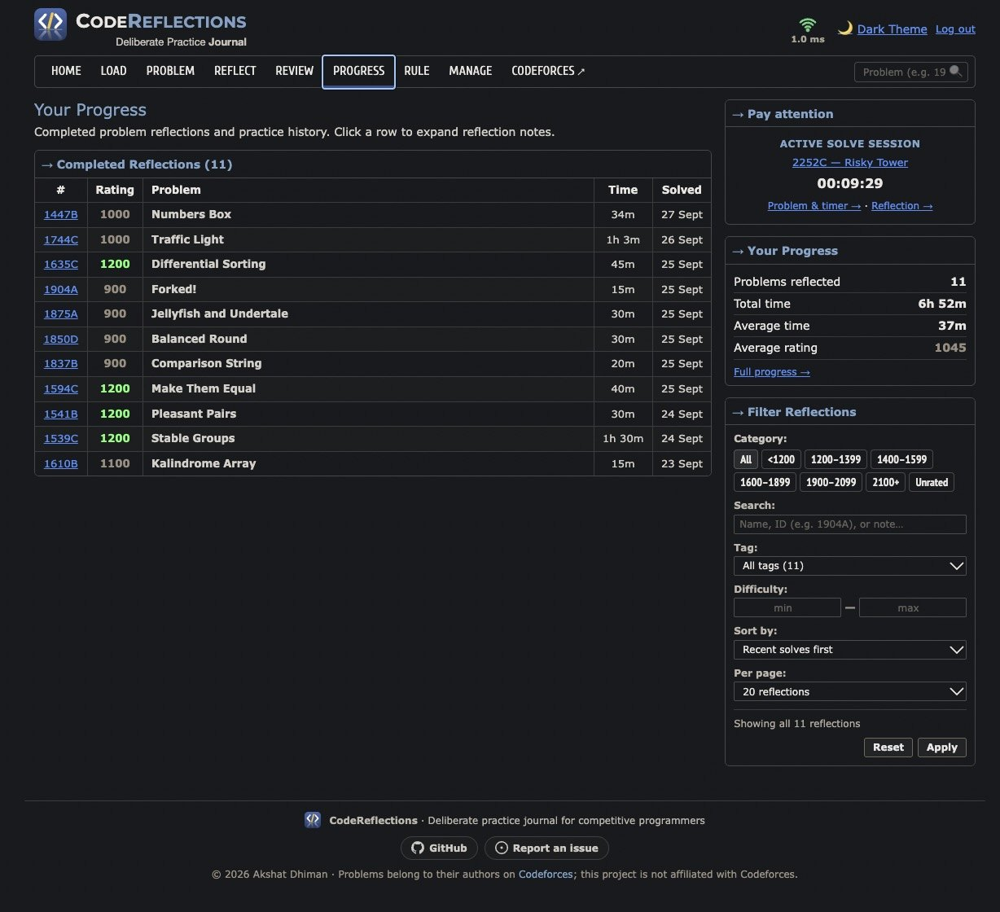
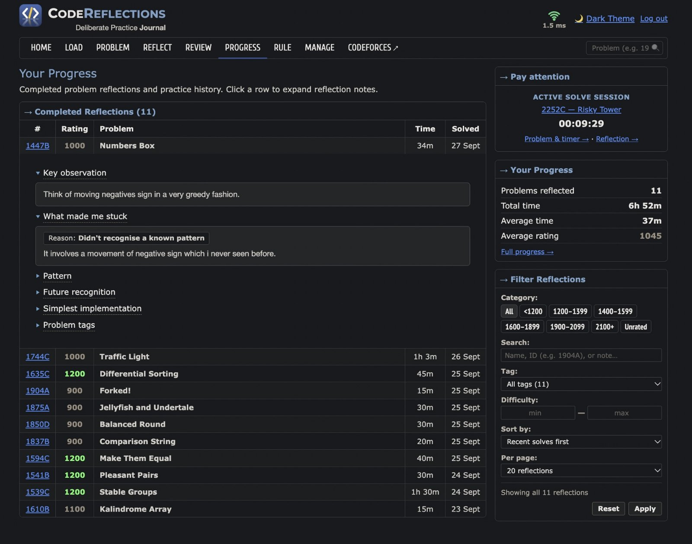
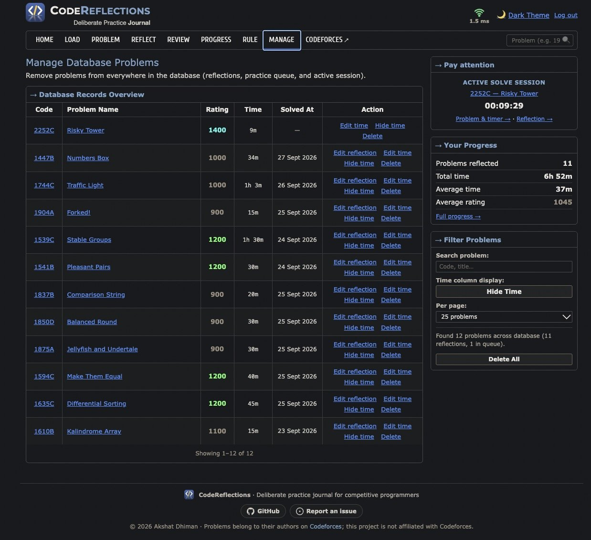
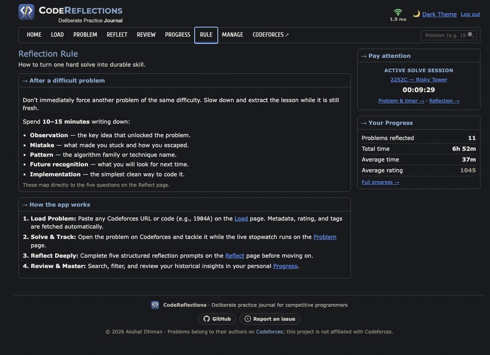

<p align="center">
  
</p>

<h1 align="center">CodeReflections</h1>

<p align="center"><b>Deliberate Practice Journal</b>: turn every hard Codeforces problem into a lesson.</p>

<p align="center">
  
</p>

A Node.js + Express app that helps competitive programmers turn each difficult Codeforces problem into reusable knowledge: solve, write down what unlocked it, and review it before you forget.

## A quick tour

<table>
  <tr>
    <td width="50%" valign="top">
      <b>1 · Load</b><br>
      <br>
      <sub>Paste codes or links (1904A, 1904B, …); name, rating and tags are fetched from Codeforces.</sub>
    </td>
    <td width="50%" valign="top">
      <b>2 · Solve</b><br>
      <br>
      <sub>The active problem with a running stopwatch, and the practice queue.</sub>
    </td>
  </tr>
  <tr>
    <td width="50%" valign="top">
      <b>3 · Reflect</b><br>
      <br>
      <sub>Five questions while it's fresh, with Markdown, code and LaTeX support.</sub>
    </td>
    <td width="50%" valign="top">
      <b>4 · Review</b><br>
      <br>
      <sub>Spaced repetition: each lesson comes back after 1, 3, 7, 14… days.</sub>
    </td>
  </tr>
  <tr>
    <td width="50%" valign="top">
      <b>5 · Progress</b><br>
      <br>
      <sub>Every reflection, with filters by rating, tag, difficulty and search.</sub>
    </td>
    <td width="50%" valign="top">
      <b>6 · Notes</b><br>
      <br>
      <sub>Expand any row to reread the observation, the trap and the pattern.</sub>
    </td>
  </tr>
  <tr>
    <td width="50%" valign="top">
      <b>7 · Manage</b><br>
      <br>
      <sub>Edit times and dates, hide times, delete; paginated.</sub>
    </td>
    <td width="50%" valign="top">
      <b>8 · The rule</b><br>
      <br>
      <sub>The reflection habit the app is built around.</sub>
    </td>
  </tr>
</table>

## Workflow

1. **Load**: paste a Codeforces problem code or URL; the server fetches its name, rating, tags, contest ID and index.
2. **Solve**: work on it while the app tracks the time spent.
3. **Reflect**: answer five questions (key observation, what made you stuck, pattern, future trigger, simplest implementation); it's saved to MongoDB.
4. **Review**: spaced repetition brings each reflection back after 1, 3, 7, 14… days; grade yourself and the schedule adapts.
5. **Progress**: search and filter your journal, and see where you get stuck most and which tags are slowest.

## Architecture

```
Browser
  ↓
Express server
  ├── HTML/CSS/JS (public/)
  ├── REST API
  │    ├── GET /api/problems/:contestId/:index
  │    └── /api/reflections
  ├── Codeforces API client (server-side only)
  └── MongoDB repositories (local mongod, or MongoDB Atlas in production)
```

## Run locally

You need a MongoDB server: install [MongoDB Community](https://www.mongodb.com/docs/manual/installation/), run it in Docker (`docker run -d -p 27017:27017 mongo:7`), or point `MONGODB_URI` at a free Atlas cluster.

```bash
npm install
npm run dev
```

Open [http://localhost:3000](http://localhost:3000). Locally the app connects to `mongodb://127.0.0.1:27017`, uses the `codereflections` database, and needs no login.

Optional environment variables:

| Variable | Effect |
|---|---|
| `MONGODB_URI` | MongoDB connection string (default `mongodb://127.0.0.1:27017`; required on Vercel) |
| `MONGODB_DB` | Database name (default `codereflections`) |
| `APP_PASSWORD_HASH` | Require a password to use the app (always required on Vercel). The value is an scrypt hash made by `npm run hash-password`, so the password itself is stored nowhere |
| `APP_PASSWORD` | Older alternative: the password in plain text. Used only when `APP_PASSWORD_HASH` isn't set |
| `SESSION_SECRET` | Optional key for signing login cookies (by default derived from the password hash) |

### Data model

| Collection | Contents |
|---|---|
| `reflections` | One document per solved problem, unique on `(contestId, problemIndex)`, with an integer `id` |
| `practice_queue` | Problems waiting to be solved, unique on `(contestId, index)`, ordered by integer `id` |
| `review_state` | Spaced-repetition state per reflection (`reflectionId`) |
| `review_log` | Every review grade given |
| `counters` | Next integer id for `reflections` and `practice_queue` |

Writes that touch several collections (deleting a problem, recording a review, adding several problems to the queue) run in a transaction on a replica set or Atlas cluster. A standalone `mongod` has no transactions, so there they run one after another.

## Deploy to Vercel + MongoDB Atlas (free)

1. **Create the database**: create a free (M0) cluster in [MongoDB Atlas](https://www.mongodb.com/cloud/atlas), add a database user, and allow access from anywhere (`0.0.0.0/0`, since Vercel functions have no fixed IP). Copy the connection string (`mongodb+srv://...`).
2. **Copy your old journal into it** (optional; from the local `data/reflection.db` SQLite file or a Turso database, keeping ids and review history):
   ```bash
   MONGODB_URI="mongodb+srv://..." npm run migrate:mongo
   # from Turso instead of the local file:
   SOURCE_DATABASE_URL="libsql://..." SOURCE_AUTH_TOKEN="..." MONGODB_URI="mongodb+srv://..." npm run migrate:mongo
   ```
   Or from a CSV export of the tables (one file per table, named `…reflections.csv`, `…practice_queue.csv`, `…review_state.csv`, `…review_log.csv`):
   ```bash
   MONGODB_URI="mongodb+srv://..." npm run import:csv -- --dry-run exports/*.csv   # check the files only
   MONGODB_URI="mongodb+srv://..." npm run import:csv -- exports/*.csv
   ```
   Both refuse to write into a database that already has data; add `--force` to replace it.
3. **Deploy**: import the repository in Vercel (framework preset "Other"; `vercel.json` sets the build) and add these environment variables:
   - `MONGODB_URI`: from step 1 (and `MONGODB_DB` if you don't use the default name)
   - `APP_PASSWORD_HASH`: run `npm run hash-password`, type your password twice, and paste the printed value (the API refuses to run on Vercel without a password)
4. Open the site, log in, done.

`vercel.json` runs the API in Vercel's Mumbai region (`bom1`). **Put the Atlas cluster in the same place** (AWS Mumbai, `ap-south-1`), or change `regions` to the Vercel region closest to your cluster (e.g. `dub1` for AWS Ireland `eu-west-1`, `iad1` for AWS `us-east-1`): every database query is a round trip between the two, so the distance adds to each page load. The latency signal at the top right of the app shows the result.

How it runs on Vercel: `public/` is served by the CDN (`npm run build` copies KaTeX and Prettify into `public/vendor/`), and every `/api/*` request goes to one serverless function (`api/index.js`) running the same Express app as locally. Warm invocations reuse one MongoDB connection pool.

## Move the database to another cluster

Free (M0) Atlas clusters can't change region, so moving one means creating a new cluster and copying the data. `npm run copy:cluster` does that with the app's own driver (no MongoDB tools to install): every collection with its documents (ids and types kept) and indexes, a backup file first, and a count check at the end.

1. In Atlas, create the new cluster, a database user, and allow `0.0.0.0/0` in **Network Access**.
2. Copy: run `npm run copy:cluster` and paste the old cluster's connection string, then the new one's, when asked (Atlas: **Connect → Drivers**; replace `<db_password>` with the real password). Pasting avoids the shell's quoting rules; the strings can also come from `SOURCE_MONGODB_URI` and `TARGET_MONGODB_URI`.

   It refuses to write into a target that already has data; add `--force` to replace it. `MONGODB_DB` picks the database (default `codereflections`).
3. In Vercel, set `MONGODB_URI` to the new cluster and redeploy. Once it works, delete the old cluster.

Only a backup: `npm run copy:cluster -- --backup-only` (saved in `backups/`, which git ignores: it's your whole journal). Push a backup to a cluster: `npm run copy:cluster -- --restore backups/<file>.json`.

## Security

- **Login**: the password is stored only as a salted scrypt hash (`APP_PASSWORD_HASH`, from `npm run hash-password`); checking it takes about 0.1 s, so guessing is slow even if the hash leaks. Use a long passphrase you don't use anywhere else. After 10 wrong passwords from one IP within 15 minutes, that IP is locked out until the window ends (tracked in MongoDB, shared by all serverless instances). Session cookies are signed with a key derived from the hash (or `SESSION_SECRET`), so a captured cookie can't be used to guess the password, and changing the password logs out every session.
- **Switching from `APP_PASSWORD`**: run `npm run hash-password`, add `APP_PASSWORD_HASH` in Vercel, delete `APP_PASSWORD`, redeploy. While both are set, the hash wins.
- **Local mode**: without `APP_PASSWORD` there is no login, so the dev server listens on `127.0.0.1` only. Set `HOST=0.0.0.0` to expose it (only with a password).
- **API writes** must be JSON and, when the browser sends an `Origin`, come from the same site; this blocks cross-site form posts (CSRF). Problem data is validated (Codeforces-style ids, `http(s)` URLs only), and the UI escapes everything it renders.
- **Headers**: `X-Frame-Options: DENY`, `frame-ancestors 'none'`, `nosniff`, and a strict referrer policy, from Express and from `vercel.json` for static files.

## API

### Get problem metadata

`GET /api/problems/2263/B`

### List reflections

`GET /api/reflections`

### Get one reflection

`GET /api/reflections/2263/B`

### Create or update reflection

`POST /api/reflections`

### Health check

`GET /health` → `{ "status": "ok" }`

## Design

The UI follows the visual language of Codeforces: white background, thin borders, compact panels, blue section headings, dense tables, and a main content + right sidebar layout. It is a practice journal, not a modern SaaS dashboard.
